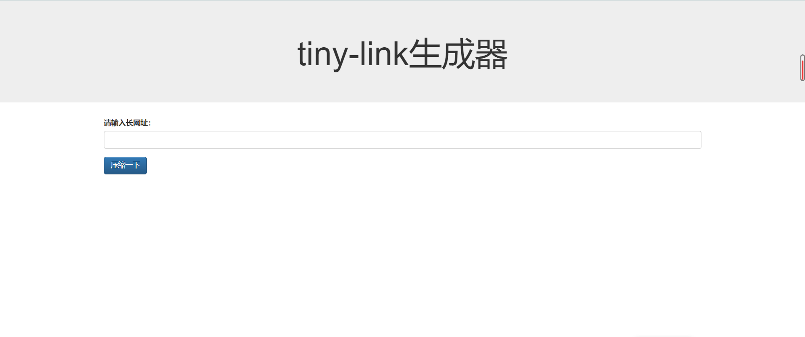
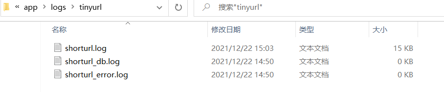

### 一个简易短网址生成器

#### 项目结构


#### 创建数据库及表

##### 创建数据库：
创建一个 tinyurl 库。
```mysql
create database tinyurl;
```

##### 创建表：
创建一张tiny_urls表。
```mysql
CREATE TABLE `tiny_urls` (
  `id` int(11) NOT NULL AUTO_INCREMENT,
  `original_url` text NOT NULL,
  PRIMARY KEY (`id`)
) ENGINE=InnoDB DEFAULT CHARSET=utf8;
```

#### 运行项目
运行app.py，启动项目。
```python
python app.py
```

##### 访问
启动后，访问 http://127.0.0.1:5010/index.html 。




##### 访问时生成的日志
> 图为Windows10下的测试结果展示



#### 部署
代码上传centos7的root目录下.

打一个名为 tinyurl_docker 镜像：
```shell
docker build -t tinyurl_docker .
```

运行一个容器名为tinyurl_app 的容器：
```shell
docker run --name tinyurl_app -p 5010:5010 -v /root/tinyurl:/tinyurl -d tinyurl_docker
```

#### base62
base62代码编解码来自这里：https://stackoverflow.com/questions/1119722/base-62-conversion

#### 说明
> 该tinyurl项目可能存在诸多问题，请酌情参考使用。